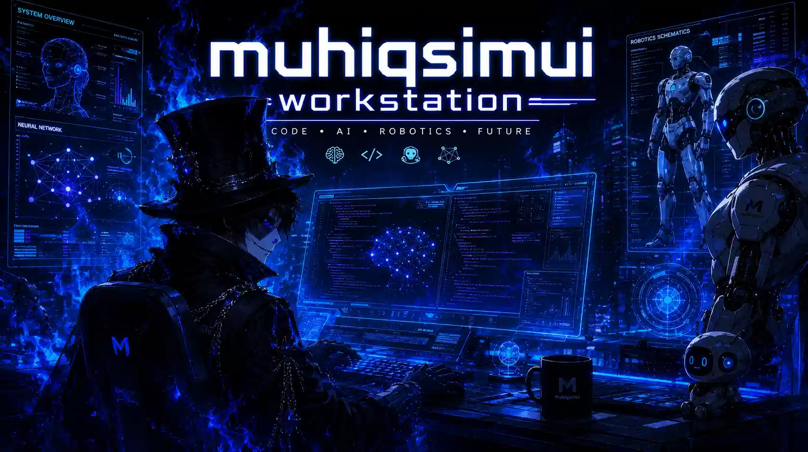

<!-- PROFILE WING  -->

  

 
<!-- CLOSE  -->

<!-- SOCIAL MEDIA -->

  
:zap: My Techstack

  
  <!-- Bahasa Programming -->

<!-- Framework -->

<!-- Other Framework -->

<!-- Styling -->

<!-- Database -->

<!-- Cloud skill -->

  
:zap: GitHub Stats

 
## Stat Github

